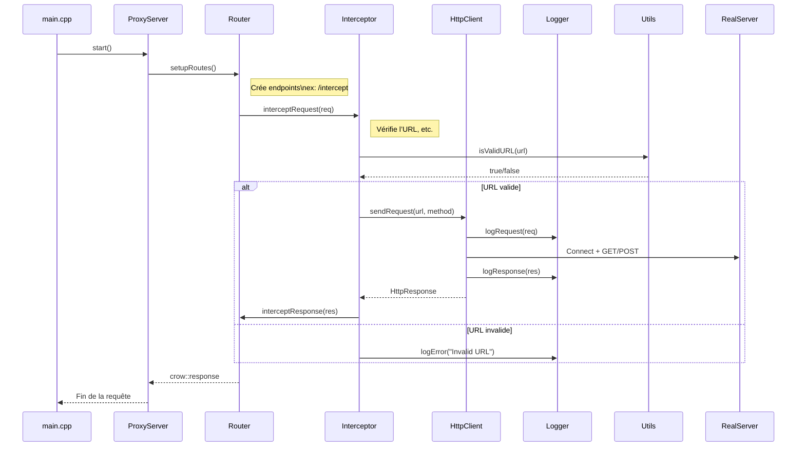

# HTTP Interceptor

Ce projet a pour but de réaliser une API qui permettra de réaliser des interceptions HTTP. Un genre de burpsuite. Cela servira comme back end pour application Web que j'hosterai sur mon [serveur](https://github.com/Macbucheron1/srv-mac)

## Schema 

